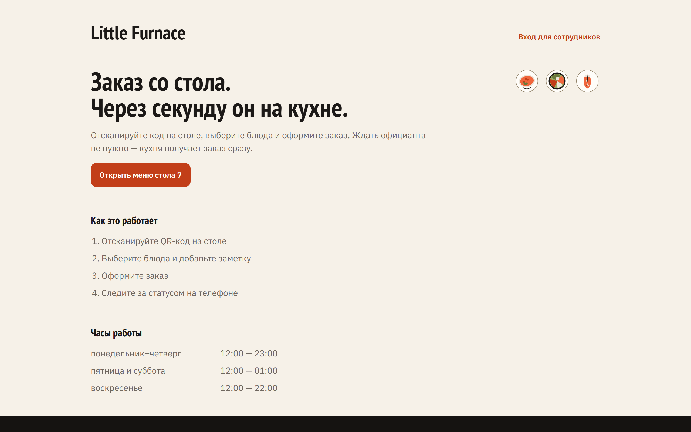
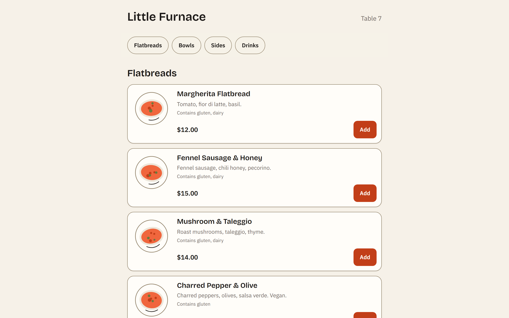
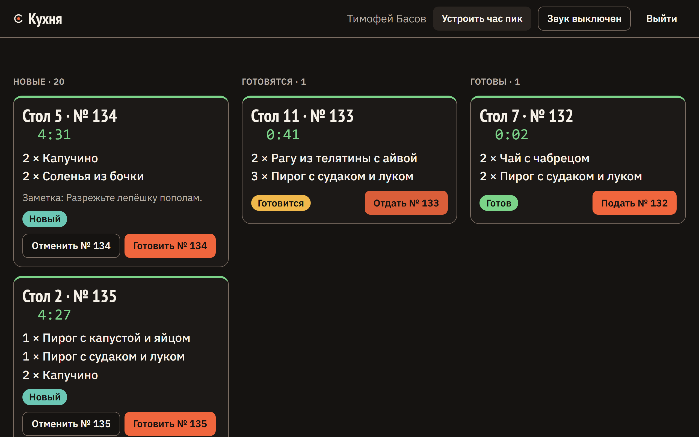
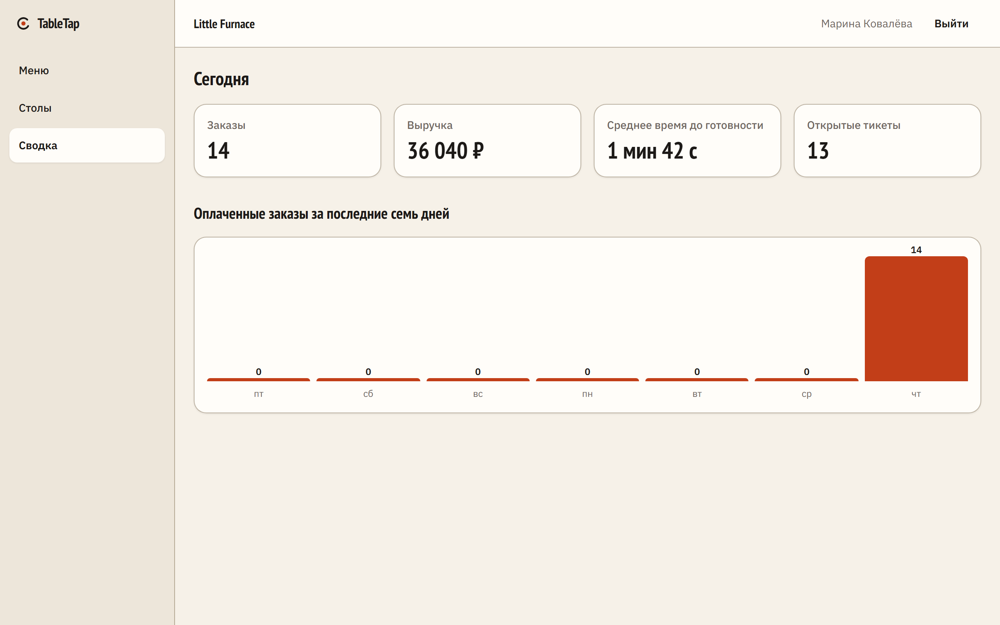

# TableTap

A guest scans the code on the table, orders from their phone, pays, and the ticket appears on the kitchen board the moment the payment settles.

**Live demo: <https://tabletap-web.vercel.app>** — the whole product, on three free tiers. On the free tier the API sleeps when nobody is here, so the first page after a quiet spell can take about a minute; measured on 2026-09-06 at 34 s cold against 0.6 s warm. Nothing takes a card: payments run in demo mode.

| The demo landing                                                                                                                                       | The guest menu                                                                                                                                             |
| ------------------------------------------------------------------------------------------------------------------------------------------------------ | ---------------------------------------------------------------------------------------------------------------------------------------------------------- |
|                 |           |
| **The kitchen board**                                                                                                                                  | **The admin dashboard**                                                                                                                                    |
|  |  |

**[Read the case study](docs/case-study.md)** — four problems where the obvious answer was wrong, what each one cost, and how the mistakes were found.

TableTap is a QR table-ordering system for a single restaurant: a guest scans the code on the table, orders from their phone, and the kitchen sees the ticket appear in real time. It is a portfolio project built milestone by milestone, with the design pipeline, the tests and the infrastructure treated as part of the product rather than as an afterthought.

The demo tenant is **Little Furnace**, a neighbourhood wood-fired place — flatbreads, grain bowls, a short list of sides and drinks.

## Milestones

| Milestone                    | Scope                                                                                                                  | Status    |
| ---------------------------- | ---------------------------------------------------------------------------------------------------------------------- | --------- |
| M1 Foundation                | Monorepo, schema and migrations, staff auth, guest sessions, RBAC, shared contracts, design tokens, Docker Compose, CI | Done      |
| M2 Guest flow + demo landing | Menu, basket, order placement, illustrated dishes, demo landing with QR, hourly demo reset                             | Done      |
| M3 Kitchen display           | Socket.io, kitchen board, order-state enforcement                                                                      | Done      |
| M4 Payments                  | Payment port with a Stripe adapter and a demo terminal, signed webhook, idempotent settlement                          | Done      |
| M5 Admin                     | Menu and tables edited in place, photo uploads to object storage, a printable QR sheet, revocable codes, a dashboard   | Done      |
| M6 Polish + portfolio        | Motion, Lighthouse CI, deployment, case study                                                                          | In review |

M2 makes the product visible: a guest scans the QR on the table, reads the menu, fills a basket and places an order. M3 closes the loop — the ticket is on the kitchen board in well under half a second, the kitchen moves it through the statuses, and the guest's phone follows along without a reload. M4 puts the money in the middle of it: an order is placed, then paid, and only a payment event sends it to the kitchen. M5 hands the restaurant its own tool: everything the seed used to decide — the dishes, their prices and photographs, the tables and their printed codes — is now something an admin changes on screen.

## Try the demo

Bring the stack up (Docker section below, or local development), then open <http://localhost:3000>.

1. **Landing.** Three cards — Guest, Kitchen, Admin — plus a QR code for table 7, a note saying how often the demo data resets, and one saying what paying costs here: "Payments run in demo mode: no card, no money.", or the Stripe test card when a key is configured.
2. **Become a guest.** Scan the QR with a phone on the same network, or click **Table 7 as a guest**. Either way you land on `/t/<token>`, which claims the table and forwards you to the menu.
3. **Menu.** Four categories, twenty dishes, each with its own drawn plate (ADR 0007). `Add` turns into a `−`/`+` stepper; sold-out dishes say "Sold out today" and cannot be added. A sticky bar at the bottom counts the basket.
4. **Basket.** **View basket** opens a bottom sheet: quantities, removals, subtotal, **Go to checkout**.
5. **Checkout.** Prices are re-read from the server, not from the basket. Add a note for the kitchen and press **Place order**.
6. **Order page.** "Order #42 is waiting for payment.", the table, a status badge, the lines, the note, and "Placed 2 min ago" ticking every 30 seconds. A **Pay $28.00** button sits under the headline.
7. **Pay.** The button opens a payment attempt and follows wherever the provider points. In demo mode that is `/pay/<order id>`, the restaurant's own terminal — the amount, a dead keypad, **Pay** and **Decline** side by side, and "This is a demo. No card, no money." Pay, and you land back on the order page reading "Order #42 sent to the kitchen."; decline, and it says "Payment declined. Try again." with the Pay button still there.
8. **Watch it cook.** The ticket is on the kitchen board the moment the payment settles. The status updates in place as the kitchen works it, and "Order #42 is ready." is announced when it is.
9. **Run the restaurant.** Open <http://localhost:3000/login?demo=admin&next=/admin> to arrive as Mara Quinn on the admin surface: the day's figures, the menu edited row by row, and the tables with their printed codes. Change a price and reload the guest menu; it is the same menu.

The two staff cards sign you in with one click: **Open the kitchen display** and **Open the admin** go to `/login?demo=kitchen` and `/login?demo=admin`, which sign in with the seeded credentials below. Both land on the kitchen board, because that is what `/login` defaults to — so the admin card opens the board as an admin rather than the admin surface M5 built. Reach it with the `&next=/admin` link above, or by opening `/admin` once signed in. Pointing the card at it is on the backlog. **Simulate rush** on the landing gives the board something to do without a second device.

Guest URLs added in M2: `/t/<token>`, `/menu`, `/checkout`, `/orders/<id>`, `/session-ended`. M3 adds the staff board at `/kitchen`, M4 the demo terminal at `/pay/<id>`, M5 the admin at `/admin` and its three rooms `/admin/dashboard`, `/admin/menu` and `/admin/tables`. `/` is the landing page (M1's redirect to `/login` is gone).

The demo data is wiped and re-seeded every `DEMO_RESET_INTERVAL_MINUTES` (default 60). A reset deletes orders and guest sessions, so a guest who was mid-order gets sent to `/session-ended` on their next tap and starts again by scanning. Table ids are stable across resets, so the printed QR code and the basket kept under it both survive one. With `DEMO_MODE=false` the landing degrades gracefully — the same page without the QR code and without the sign-in buttons — and `GET /api/demo/links` answers 404.

## Kitchen display

`/kitchen` is a dark, full-bleed ticket board for signed-in staff, meant to be read from a metre away. An anonymous visit redirects to `/login?next=/kitchen`; a guest session is sent back to the landing.

**Three columns.** New (`paid` only — an order that is placed but unpaid belongs to the guest's phone, not to the pass), Cooking, Ready. The oldest ticket sits at the top of each column, because that is the order a cook works in; the newest carries an ember left edge so it is still easy to find, and the tab title counts the untouched ones — `(3) Kitchen · TableTap`. Served and cancelled tickets leave the board; there is no history view yet.

**Timers.** Each ticket shows elapsed time in mono digits, restarted at each step: waiting counts from `placedAt`, cooking from `cookingAt`, ready from `readyAt`. It ticks once a second and crosses two thresholds — warning at 5 minutes, late at 10 — which colour the timer and a thin rule at the top of the card. Colour is never the only carrier: the badge always says "5 min" or "late" and carries an icon.

**Bumping.** One control at the bottom edge of every ticket: **Start** on a New ticket, **Ready** on a Cooking one, **Served** on a Ready one, each naming its number in the accessible label ("Start #42"). New tickets also carry **Cancel** behind a confirm. The move is optimistic — the ticket shifts column immediately and the request follows. If another screen got there first the API answers 409 and the board says so: "Couldn't move #42. It is Cooking now.", then resyncs.

**Sound.** A **Sound** toggle plays a two-note chime when a ticket enters the New column — the moment the payment settles, not the moment the guest places the order, since an unpaid ticket is not work the kitchen can start. It is synthesized with the Web Audio API rather than shipped as an asset, and it is off until pressed, because browsers only allow audio after a gesture. The choice is remembered in `localStorage`.

**Simulate rush.** In demo mode a **Simulate rush** button sits in the board header and on the landing page. It asks `POST /api/demo/rush` to place twelve orders over sixty seconds through the same insert path a guest uses, from random tables with one to four dishes each, so a rush ticket is indistinguishable from a real one. A second rush while one is running is refused, and the button goes quiet for the length of the run. The hourly demo reset stops a running rush before it reseeds and then broadcasts `demo:reset`, which tells every open board and every guest order page to clear and subscribe again.

**How the live connection works.** The board asks `POST /api/socket-token` over the ordinary proxied REST path — where the session cookie is first-party — and gets back a 60-second JWT, typed `tt-socket` and signed with `SOCKET_TOKEN_SECRET`; a fresh one is minted before every connection attempt, reconnects included. The Socket.io handshake verifies that token, and the **server** puts the socket in its room from the token's principal — `kitchen` for staff, `session:<guestSessionId>` for a guest — so no client can ask to listen to somebody else's orders, and a tab left open on a table's last sitting goes quiet when the next party claims it. On connect the client emits `subscribe` and receives the whole board as a snapshot; the board merges it over what it holds rather than replacing it, so an order placed while the snapshot was being read is not erased by the snapshot that could not know about it. If the server cannot answer, it says so and the board keeps its tickets and retries. Between snapshots an event is ignored when its `updatedAt` is older than the copy the board holds, and every timer is measured against the server's clock rather than the screen's. When the connection goes, the board says so within seconds — it listens for the browser's own offline event, and the server's heartbeat (10 s interval, 5 s timeout) catches whatever the browser does not notice. The reasoning is in [ADR 0008](docs/adr/0008-realtime-delivery.md).

M3 let a cook start a placed order that nobody had paid for. That edge was deliberate, narrow and dated, and M4 removed it: `placed` now reaches only `paid` or `cancelled`, and `paid` has exactly one writer. See [ADR 0009](docs/adr/0009-interim-state-machine.md), now superseded by [ADR 0010](docs/adr/0010-payments-one-port.md).

## Payments

An order is placed, then paid, and only a payment event sends it to the kitchen. `paid` has exactly one writer — `settlePayment` in `apps/api/src/lib/payments.ts` — and it is reached from two places: the signed Stripe webhook, and the demo terminal's completion route. No role can set `paid` through the transition API, and the browser coming back from a payment page is treated as a hint rather than as evidence. The reasoning is in [ADR 0010](docs/adr/0010-payments-one-port.md).

**Two providers behind one port.** `PaymentProvider` (`apps/api/src/payments/types.ts`) is `createSession` plus `readEvent`, and that is the whole surface a processor gets. Which adapter runs is decided at boot and by configuration alone:

| `STRIPE_SECRET_KEY` and `STRIPE_WEBHOOK_SECRET` | Provider | What a guest sees                                                                       |
| ----------------------------------------------- | -------- | --------------------------------------------------------------------------------------- |
| both set                                        | `stripe` | Stripe Checkout in test mode, and the landing shows the test card `4242 4242 4242 4242` |
| either empty                                    | `demo`   | The in-app terminal at `/pay/<id>`, and the landing says "no card, no money"            |

Setting one variable and forgetting the other resolves to `demo` — the deployment boots and takes no money. Check the landing's payment line, or `GET /api/demo/links`, which reports the resolved provider.

**The demo terminal** is the restaurant's own card machine, drawn honestly: the amount at display size, a dead keypad that is hidden from assistive technology because none of its keys is a control, and **Pay** and **Decline** side by side at the same weight. Where a bank page would put a card number, this one says "This is a demo. No card, no money." It is not a mock of the settlement — pressing Pay posts to `POST /api/payments/demo/complete`, which builds the same event shape the webhook carries and calls the same `settlePayment`, so the demo run exercises the idempotency guard, the amount check, the transaction and the socket broadcast that would carry a real payment. Every row it writes says `demo`. See [ADR 0011](docs/adr/0011-demo-payment-provider.md).

That route is registered only when the resolved provider is `demo` **and** `DEMO_MODE=true`. With Stripe configured it does not exist — not guarded, absent — because it grants `paid` to a guest-authenticated call, which is only acceptable where no money exists to move.

**Environment.**

| Variable                | Side | What it does                                                                                                                                             |
| ----------------------- | ---- | -------------------------------------------------------------------------------------------------------------------------------------------------------- |
| `STRIPE_SECRET_KEY`     | API  | Stripe API key. Optional; blank or unset counts as absent. Set together with the next one to run Stripe.                                                 |
| `STRIPE_WEBHOOK_SECRET` | API  | The signing secret the webhook verifies against (`whsec_…`, printed by `stripe listen`). Optional, and only meaningful with the key above.               |
| `DEMO_MODE`             | API  | Already documented under Demo mode. It also gates the demo completion route: `demo` provider with `DEMO_MODE=false` leaves an attempt nobody can finish. |

**Running Stripe locally.** Set both variables, then forward events to the API with the Stripe CLI:

```bash
stripe listen --forward-to localhost:4000/api/payments/webhook
```

It prints a `whsec_…` secret; that is `STRIPE_WEBHOOK_SECRET` for this session. The webhook takes its body as raw bytes inside its own Fastify scope — the signature covers what was sent, not what a parser rebuilt — and answers 200 for anything it accepts, including a replayed event and an amount that does not match the order, because any other status only makes Stripe retry something that will never change. Neither is silent: a replay is already recorded in `processed_events` from the delivery that did the work, and a mismatch writes a `payment.mismatch` audit row carrying both figures. A success for an order that is already paid — a guest who completed checkout twice — is answered the same way: the order is left alone, the attempt the event names is closed, and a `payment.overpaid` row records the amount and the payment id, so the second charge can be found without asking Stripe what an event id meant.

**Endpoints.**

| Method and path                    | Who                                 | What                                                                                                              |
| ---------------------------------- | ----------------------------------- | ----------------------------------------------------------------------------------------------------------------- |
| `POST /api/orders/:id/payment`     | the guest who owns a `placed` order | Opens an attempt and answers `{ url }` — Stripe's absolute checkout URL, or `/pay/<id>`. 10/min per guest cookie. |
| `POST /api/payments/webhook`       | the provider                        | Signature first, then `settlePayment`. 400 `SIGNATURE_INVALID` if it does not verify.                             |
| `POST /api/payments/demo/complete` | the guest, demo mode only           | `{ orderId, outcome: 'paid' \| 'declined' }`. Same settlement, synthetic event.                                   |

**Simulate rush** places orders that are already paid, with a `demo` payment row and a `payment.succeeded` audit line marked `source: 'rush'` — otherwise the narrowed New column would stay empty.

## Admin

`/admin` is the restaurant's own tool, for the `admin` role alone. An anonymous visit redirects to `/login?next=/admin`; a kitchen member is sent to the board and a waiter to the landing, because the point is to put each of them somewhere they have something to do rather than on a screen full of refusals. It is light and dense where the kitchen board is dark and large: a sidebar, a top bar, no centred column and no marketing rhythm. `/admin` itself is the door and opens on the dashboard.

**Three screens.**

- **`/admin/dashboard`** — four figures for today, and seven days of paid orders as CSS bars, no chart library. Orders taken, revenue in the restaurant's own currency, the average time from paid to ready, and how many tickets are open right now. "Today" means the restaurant's day: the boundaries come from `restaurants.timezone`, so a place in Lisbon does not roll over at midnight UTC. An order that was paid and later cancelled still counts — the money was taken and this milestone has no refunds.
- **`/admin/menu`** — categories and dishes, edited where they are read. No dialog ever opens: a row expands in place, its cells become inputs at the same line height, and an explicit **Save** and **Cancel** sit in the row. One row is open at a time, opening another closes the one before it, and a refused save puts the previous values back and says what the server refused. The expanded panel carries the description, the allergens, the sort order, the photograph and **Delete**.
- **`/admin/tables`** — the room in number order: number, label, seats, and whether the table is in service. **Deactivate** is one press and entirely reversible. **Print QR sheet** downloads the PDF, and **Reissue QR** retires a table's printed codes.

**What a refusal means.** A category holding dishes, a dish that is on an order and a table that has orders cannot be deleted: the foreign keys are `restrict`, and quietly cascading away order history is not something an admin tool should do. Each answers 409 `IN_USE` and the row says what to do instead — empty the category, mark the dish sold out, deactivate the table. Two people editing the same row is 409 `CONFLICT` ("This item changed while you were editing it. Reload and try again."), decided by an `updatedAt` guard inside the `UPDATE`'s own `WHERE`. Every write leaves an audit row carrying both the previous and the new values.

**Reissuing a QR is the one control that cannot be undone.** It bumps `tables.qr_version`, which travels inside the signed table token, so every card already printed for that table stops working on the next scan — including the one in your hand. Guests already sitting there are unaffected: their session rests on the signed cookie, not on the token. The control says so before it acts, swapping the row's buttons for the question "Reissue the QR for table 7? Every printed code for this table stops working immediately." with **Keep the current code** as the answer that costs nothing. Print the sheet again afterwards. The reasoning, and what a retired code is worth to whoever holds it, is in [ADR 0013](docs/adr/0013-revocable-qr.md).

**The QR sheet.** `GET /api/tables/qr.pdf` renders A4 portrait with `pdfkit`, six cards to a page, one card per **active** table: the table's number, its label, a 45 mm code and the line "Scan with your phone camera to see the menu and order." Each code is signed at the version the table carries at that moment and lasts `TABLE_TOKEN_TTL_DAYS` (365), so a printed sheet outlives a demo reset. The response is `application/pdf` as an attachment, and the link is a plain `<a href>` rather than a fetch — the Next.js rewrite makes it a same-origin navigation, so the staff cookie rides along and the browser saves the file without leaving the page. The sheet prints in Helvetica: `@fontsource/ibm-plex-sans` ships woff and woff2 only, neither of which pdfkit can embed. Dropping a TTF into the package switches the face with no other edit — see the backlog, because it is not a no-op.

**Photographs go to object storage, not through the API.** The browser asks for a URL, uploads straight to the store, and the API confirms: `POST /api/menu/items/:id/photo-url` answers a `PUT` signed for one key, one content type and sixty seconds; the browser uploads; `POST /api/menu/items/:id/photo` checks the object is there, is under 5 MB and is a JPEG, PNG or WebP, deletes it if it is not, and only then writes `image_url` from the server's own public URL for that key. A dish with a photograph shows it on the guest menu in place of its drawn plate ([ADR 0007](docs/adr/0007-illustrated-menu.md)). The whole shape is in [ADR 0012](docs/adr/0012-object-storage-uploads.md).

Locally the store is MinIO, brought up by Compose: `docker compose up` starts it on 9000 (the S3 API) and 9001 (the console, signed in with the two keys below), and a one-shot `minio-init` creates the bucket and opens its `menu/` prefix — and only that prefix — to anonymous readers, because a guest who scanned a QR code has no session to authenticate a photograph with. Nothing else in the bucket is public.

| Variable               | Side | What it does                                                                                                                                                                                                |
| ---------------------- | ---- | ----------------------------------------------------------------------------------------------------------------------------------------------------------------------------------------------------------- |
| `S3_ENDPOINT`          | API  | Where the API itself dials the store. Compose sets `http://minio:9000`, which is the name on the compose network. Required.                                                                                 |
| `S3_BUCKET`            | API  | Bucket name. Required.                                                                                                                                                                                      |
| `S3_ACCESS_KEY_ID`     | API  | Required. Also MinIO's root user under Compose.                                                                                                                                                             |
| `S3_SECRET_ACCESS_KEY` | API  | Required. Also MinIO's root password under Compose. Never leaves the server.                                                                                                                                |
| `S3_REGION`            | API  | Default `us-east-1`. MinIO does not care; S3 does.                                                                                                                                                          |
| `S3_PRESIGN_ENDPOINT`  | API  | The origin an upload URL is _signed_ for. SigV4 covers the Host header, so this has to be where the **browser** will PUT: under Compose `http://localhost:9000`, while the API keeps dialling `minio:9000`. |
| `S3_PUBLIC_URL`        | API  | Base URL a guest's browser reads a photograph from — a CDN or an R2 custom domain in production. Unset, the endpoint and the bucket stand in for it.                                                        |
| `S3_FORCE_PATH_STYLE`  | API  | `true` for MinIO and R2, `false` for AWS S3's virtual-hosted addressing. Default `true`.                                                                                                                    |

Blank the four required ones and the API starts without photographs rather than failing to boot: `/menu/items/:id/photo-url` and its confirmation answer 503, and everything else works. Under Compose the `api` service sets them itself, so blanking them in `.env` changes nothing there. For AWS S3 use `S3_ENDPOINT=https://s3.<region>.amazonaws.com` with path style `false`; for Cloudflare R2 use the account endpoint with path style `true` and point `S3_PUBLIC_URL` at the bucket's public domain.

**Endpoints.** Everything that writes wants the `admin` role, as does the dashboard and the QR sheet. `GET /api/tables` guards with `requireStaff('waiter', 'kitchen', 'admin')` — open to any signed-in staff, which is what `tables.read` grants, but the route names the roles rather than the action. Reading the menu is the guest's own permission and unchanged. The QR sheet and the photo-upload URL each carry a rate limit of their own, since `server.ts` turns the global limiter off.

| Method and path                      | What                                                                                               |
| ------------------------------------ | -------------------------------------------------------------------------------------------------- |
| `GET /api/dashboard`                 | Today's four figures and the seven-day count, in the restaurant's timezone.                        |
| `POST /api/menu/categories`          | Create. `PATCH` and `DELETE` on `/:id`; delete refuses 409 `IN_USE` while it holds dishes.         |
| `POST /api/menu/items`               | Create. `PATCH` and `DELETE` on `/:id`; delete refuses 409 `IN_USE` once the dish is on an order.  |
| `POST /api/menu/items/:id/photo-url` | A presigned `PUT`: `{ url, key, expiresInSeconds }`. 503 when no store is configured.              |
| `POST /api/menu/items/:id/photo`     | Confirms `{ key }` after checking the object, and answers the updated dish.                        |
| `GET /api/tables`                    | The room. `POST` creates, `PATCH /:id` renames or deactivates, `DELETE /:id` refuses 409 `IN_USE`. |
| `POST /api/tables/:id/qr`            | Reissues: `qr_version + 1`, audited, irreversible for printed codes.                               |
| `GET /api/tables/qr.pdf`             | The printable sheet, `application/pdf` as an attachment.                                           |

## Stack

- **Web** — Next.js 16 (App Router), React 19, Tailwind 4, shadcn components consumed from `@tabletap/ui`
- **API** — Fastify 5, Zod 4 via `fastify-type-provider-zod`, pino, better-auth 1.7 for staff sessions
- **Real-time** — Socket.io 4.8 on both ends, with the event map typed once in `@tabletap/shared`
- **Data** — PostgreSQL 17, Drizzle ORM 0.45, SQL migrations generated by drizzle-kit and committed
- **Storage** — S3-compatible object storage through the AWS SDK v3 and its request presigner; MinIO locally, S3 or R2 in production. PDFs with `pdfkit`, QR codes with `qrcode`
- **Tests** — Vitest 4 everywhere; the API and database tests run on PGlite (embedded Postgres, no Docker needed), Playwright 1.62 for the end-to-end smoke tests, Lighthouse 13 for the accessibility gate
- **Tooling** — pnpm workspaces via corepack, Turborepo, TypeScript strict, ESLint 9 flat config, Prettier
- **Infra** — Docker Compose (postgres, minio, minio-init, api, web), GitHub Actions

Architecture decisions are recorded in [`docs/adr/`](docs/adr/).

## Quick start with Docker

```bash
cp .env.example .env
docker compose up --build
```

- Web: <http://localhost:3000> — the demo landing
- API: <http://localhost:4000> — try <http://localhost:4000/health>
- MinIO: <http://localhost:9000> is the S3 API menu photographs are uploaded to and read from; <http://localhost:9001> is its console, signed in with `S3_ACCESS_KEY_ID` and `S3_SECRET_ACCESS_KEY`

The API container applies the migrations and runs `seed --if-empty` before starting, so the demo data and the three staff accounts are there on first boot. It waits for MinIO's healthcheck and for the one-shot `minio-init` that creates the bucket, so the store is ready before the first upload URL is asked for. `.env.example` sets `DEMO_MODE=true`, which is what puts the QR code and the sign-in buttons on the landing page.

**Local evidence:** the `compose-e2e` job brings the stack up, runs the Playwright specs and then the Lighthouse audit against it, and the same sequence is run by hand on this machine before every merge — M3 and M4 on 2026-09-04, M5 on 2026-09-05, each against a stack built from scratch. CI runs on every push to <https://github.com/chitkid/tabletap>, and both jobs — `check` and `compose-e2e` — were green on the most recent run. Compose arrived here on 2026-09-03, so it is a young part of the project: if you hit a problem with Compose, e2e or the audit, that is the likeliest place for it.

**HTTPS deployments:** the Compose file defaults `COOKIE_SECURE` to `false`, because the local demo is served over plain HTTP while the container itself runs `NODE_ENV=production`. Behind TLS, set `COOKIE_SECURE=true` — otherwise session cookies are issued without the `Secure` flag. Left unset, the flag follows `NODE_ENV`.

**Behind a proxy or load balancer:** `TRUST_PROXY` (default `loopback,uniquelocal`) lists the peers whose `x-forwarded-for` the API believes. The rate limiter keys on the client IP it derives from that header, so a value that is too permissive lets a caller spoof its own address and slip the limit.

**Across two hosts:** since M6 the rate limiter no longer rests on that alone, because the web and the API are deployed to different platforms and the web's call reaches the API from an ordinary public address. `FORWARD_SECRET` is held by both: the web signs the visitor address it forwards over the `/api/*` rewrite, and the API honours a forwarded address only when that signature verifies, keying on the connection's own address otherwise. It is a plain runtime environment variable on both sides — unlike every `NEXT_PUBLIC_*` value, it is not inlined into the web build. Leave it unset and the API verifies nothing and every visitor shares one bucket; it never means "believe anyone".

## Environment

`.env.example` documents every variable, and `cp .env.example .env` is a working local configuration. Four of them decide whether the real-time layer works at all (the payment pair is in the Payments section above):

| Variable                 | Side               | What it does                                                                                                                                                                                                                                                 |
| ------------------------ | ------------------ | ------------------------------------------------------------------------------------------------------------------------------------------------------------------------------------------------------------------------------------------------------------ |
| `SOCKET_TOKEN_SECRET`    | API                | Signs the 60-second Socket.io handshake token (HS256). At least 32 characters, and a different value from `TABLE_TOKEN_SECRET`: a QR table token must not open a socket, nor the reverse (ADR 0008). Required — the API refuses to boot without it.          |
| `NEXT_PUBLIC_API_ORIGIN` | Web, at build time | The API origin the browser opens the WebSocket against, because the Next.js rewrite cannot proxy one (ADR 0004). Baked into the bundle, so moving the API means rebuilding the web image; Compose passes it as a build arg. Default `http://localhost:4000`. |
| `WEB_ORIGIN`             | API                | CORS origin for REST and, since M3, for the socket server too, plus better-auth's `trustedOrigins`. Wrong here and the board cannot connect.                                                                                                                 |
| `API_URL`                | Web, at build time | Rewrite target for `/api/*` (ADR 0004). Unchanged in M3.                                                                                                                                                                                                     |

## Local development

Node 24 (anything `>= 22` works) and a Postgres to talk to.

```bash
corepack enable
pnpm install

cp .env.example .env
docker compose up -d postgres        # or point DATABASE_URL at any Postgres 17

pnpm db:migrate
pnpm db:seed -- --if-empty           # prints the twelve guest URLs it signs
pnpm dev                             # web on :3000, api on :4000
```

`pnpm test` needs none of that — the suite runs on PGlite in memory: 662 tests across the five packages (shared 52, db 17, ui 39, api 317, web 237).

## Scripts

Run from the repository root.

| Script                       | What it does                                                                                                                                                                        |
| ---------------------------- | ----------------------------------------------------------------------------------------------------------------------------------------------------------------------------------- |
| `pnpm dev`                   | Runs every package's dev task through Turbo (web on :3000, api on :4000)                                                                                                            |
| `pnpm build`                 | Builds every package                                                                                                                                                                |
| `pnpm lint`                  | ESLint across the workspace                                                                                                                                                         |
| `pnpm typecheck`             | `tsc --noEmit` in every package                                                                                                                                                     |
| `pnpm test`                  | Vitest in every package, over PGlite                                                                                                                                                |
| `pnpm e2e`                   | Playwright smoke tests against a running stack (`E2E_BASE_URL`, default <http://localhost:3000>)                                                                                    |
| `pnpm lighthouse`            | Lighthouse audit of `/`, `/menu`, `/kitchen` and the admin dashboard against a running stack; `--base`, `--min-a11y` (default 95), `--out` (default `docs/lighthouse-results.json`) |
| `pnpm tokens`                | Regenerates `packages/ui/tokens.css` from `assets/design-tokens.json`                                                                                                               |
| `pnpm validate-tokens`       | Fails if `apps/` or `packages/ui/src` contains a raw hex, `rgb()`/`hsl()` or a px/rem value (0 and 1px excepted), Tailwind arbitrary values included                                |
| `pnpm brand:sync`            | Rebuilds the `ember` / `olive` / `ink` primitive scales in `assets/design-tokens.json` from `docs/brand-guidelines.md`, then regenerates `packages/ui/tokens.css`                   |
| `pnpm db:generate`           | drizzle-kit: generates a migration from the schema                                                                                                                                  |
| `pnpm db:migrate`            | Applies committed migrations to `DATABASE_URL`                                                                                                                                      |
| `pnpm db:seed -- --if-empty` | Seeds the demo data unless it is already there                                                                                                                                      |
| `pnpm db:seed -- --reset`    | Wipes the demo data and re-seeds it in one transaction                                                                                                                              |
| `pnpm format`                | Prettier over the repository                                                                                                                                                        |

## Tests

`pnpm test` is the unit and integration suite: Vitest across the five packages, with the API and database tests on PGlite so nothing needs a container. The socket tests are the one place that does real I/O — they start the Fastify app on an ephemeral port and connect a real `socket.io-client`, which is the only honest way to show that a token-less handshake is refused, that a table token cannot open a socket, and that a guest of table 3 never receives table 7's events.

`pnpm e2e` runs Playwright against a running stack — eight specs in four files:

- `e2e/guest-order.spec.ts` — a guest orders from the landing page's QR link and pays for it: the receipt says the order is waiting for payment, the terminal shows the amount and the disclaimer, and paying lands back on a receipt that says the kitchen has it. A second test declines instead and asserts the order is exactly where it was, with the Pay button still offering another attempt. A third checks that an expired QR code explains itself.
- `e2e/staff-login.spec.ts` — kitchen staff signs in through the same-origin API proxy and lands on the board; a wrong password shows the brand-voice message.
- `e2e/kitchen-live.spec.ts` — the milestone's definition of done, in two browser contexts at once. Context K signs in as kitchen and opens `/kitchen`; context G claims table 7 from the landing and places an order. While that order is unpaid the board must have no heading for it at all — an unpaid ticket was never on the pass, not merely gone from it. G then pays at the terminal; the test reads the order's `paidAt` from the API and records the wall-clock moment its ticket becomes visible in K, and the gap must be under 500 ms. K bumps the ticket through **Start** and **Ready**, and G's order page must say "Order #42 is ready." without a reload. Finally K goes offline and back online: the reconnect banner appears, then clears, and the board is compared against the orders in `GET /api/orders?active=1` that the board actually draws. The spec prints both numbers it measures.

- `e2e/admin.spec.ts` — the admin surface end to end, in two browser contexts each time. An admin signs in through `/login?demo=admin&next=/admin`, opens the menu, adds a dish with a name unique to the run and a price, and a guest arriving from the landing's QR link finds that dish on the menu at that price — a write that crossed from the operator's tool to the guest's phone. The second spec reads the printed link from `GET /api/demo/links`, proves it claims a table right now, reissues table 7's code through the confirmation, and then opens the same link in a fresh context, where it must read "This QR code is not valid." Proving the link worked _before_ the reissue is what stops the test passing on a token that was never valid. It ends by waiting for the landing to hand out a working link again, because the web tier remembers the demo link for 30 seconds and the other specs all start by clicking it.

On the local Compose stack that payment-to-kitchen latency measured **30–53 ms** across ten runs against the 500 ms budget, and the offline banner appeared in **7–15 ms** — the browser's offline event, well inside the 20 s the spec allows for the heartbeat to notice instead.

The suite spends five of the ten sign-ins a minute the API allows one address, so two full runs inside a minute will trip the limit and a test will read "Too many attempts. Wait a minute and try again." That is the rate limiter working, not a broken spec.

## Lighthouse

`pnpm lighthouse` claims table 7 through the web origin and signs in as the demo kitchen and admin accounts, then audits six pages on Lighthouse's mobile preset: `/` without a cookie, `/menu` as a real guest, `/kitchen` as real kitchen staff, and `/admin/dashboard`, `/admin/menu` and `/admin/tables` as a real operator. It prints a table, writes `docs/lighthouse-results.json`, and exits non-zero when accessibility falls below `--min-a11y` (95). On the M5 branch all six scored **100** for accessibility and **100** for best practices. Performance ran 93–100 over two consecutive runs against the same stack — 99 / 96 / 99 / 100 / 93 / 100, then 97 / 97 / 95 / 96 / 96 / 93 — and which page comes last moves between runs, so the spread is measurement noise on a laptop rather than a property of any one screen. On that run CLS was 0.04 on the board and 0 everywhere else, once the server started rendering each ticket's real elapsed time instead of `0:00` and the cards stopped growing on hydration. The next paragraph supersedes that figure.

`/admin` itself is not in the list, and the reason is in the script rather than in anything about cookies: the audit fails any page whose final URL differs from the one requested, because a redirect is scored as whatever it landed on — an expired guest session would send `/menu` to `/session-ended` and sail through every gate. `/admin` is a bare redirect onto the dashboard, so it would be reported as redirected on every run. The three screens behind it are audited directly instead, which is where the in-place editors and the reissue confirmation live. The demo terminal at `/pay/<id>` is still not audited: it needs a guest cookie _and_ an order that is still waiting for payment, which the audit script does not set up. On the backlog.

That gate runs in CI, in the `compose-e2e` job, after the Playwright tests. `docs/lighthouse-results.json` is gitignored: it is written on every run and uploaded as a build artifact, not committed. Accessibility is the only gated category; performance is measured and reported. M6 added no Lighthouse machinery and owed only that the motion work did not lower the existing numbers, which is why the motion M6 added is confined to `opacity` and `transform` — the colour and shadow transitions on five `packages/ui` controls predate the milestone and are untouched by it. Measured on the M6 branch with a cooking ticket deliberately on the board: accessibility 100 and cumulative layout shift 0 on all six pages, the kitchen included — the board's reconnect banner used to drop the page by 46 px when it unmounted, and the space is reserved now.

## Demo mode

The API exposes demo mode behind three variables:

| Variable                      | Default         | What it does                                                                                            |
| ----------------------------- | --------------- | ------------------------------------------------------------------------------------------------------- |
| `DEMO_MODE`                   | `false`         | Gates `GET /api/demo/links` and the reset scheduler. `.env.example` and Compose set it to `true`.       |
| `DEMO_RESET_INTERVAL_MINUTES` | `60`            | Minutes between automatic re-seeds. `0` disables the scheduler and the landing says so.                 |
| `DEMO_PASSWORD`               | `tabletap-demo` | Password for the three seeded staff accounts. Read by the seed and returned by the demo-links endpoint. |

`GET /api/demo/links` is the only public endpoint added in M2 (300 requests a minute per IP, 404 when demo mode is off). The landing calls it from the Next server, so every visitor reaches the API as one address; the web tier caches a successful answer for 30 seconds and the limit is a runaway guard rather than a per-visitor budget. It returns a freshly signed guest URL for table 7, the three staff accounts with their password, and the reset interval — everything the landing page needs, and nothing that is not already in this README. The reset itself is an in-process `setInterval` in the API that runs the seed in `--reset` mode; it never starts under `NODE_ENV=test`.

## Demo accounts

Password for all three: `tabletap-demo` (override with `DEMO_PASSWORD` before seeding).

| Email                        | Name          | Role    |
| ---------------------------- | ------------- | ------- |
| `admin@littlefurnace.demo`   | Mara Quinn    | admin   |
| `kitchen@littlefurnace.demo` | Theo Baptiste | kitchen |
| `waiter@littlefurnace.demo`  | Jun Okafor    | waiter  |

Sign in at `/login`. There is no sign-up, and M5's admin surface does not add one: it manages the menu, the tables and their codes, not the people. Staff accounts come from the seed.

## Project structure

```
tabletap/
  apps/
    api/                Fastify 5, Drizzle, better-auth, pino
      src/plugins/      auth, principal, rbac, route-guard, error-handler, demo-reset, demo-rush
      src/routes/       health, me, guest, tables, menu, orders, socket-token, payments, dashboard, demo
      src/realtime/     Socket.io server: handshake, rooms, snapshot ack, broadcasts
      src/payments/     the PaymentProvider port and its two adapters (stripe, demo)
      src/storage/      the ObjectStorage port, its S3 adapter and the photo key shape
      src/lib/          orders, transitions, payments (the one writer of `paid`), order-events (the emitter the socket listens to), rush, menu-admin, tables-admin, qr-pdf, dashboard, audit
    web/                Next.js 16 App Router, Tailwind 4, shadcn
      app/              / (landing), /login, /t/[token], /menu, /checkout, /orders/[id], /pay/[id], /session-ended, /kitchen, /admin (dashboard, menu, tables)
      components/       claim-table, menu/, basket/, checkout/, order/, pay/, landing/, kitchen/, admin/, login-form
      lib/              api client, socket, board store, timer thresholds, chime, guest cookie, basket store, money and elapsed formatting
  packages/
    db/                 Drizzle schema, migrations/, seed, migrate, PGlite test helper
    shared/             Zod schemas, roles and RBAC matrix, order transitions and rights, socket event map, table and socket tokens
    ui/                 tokens.css (generated), theme.css, shadcn components, plate illustrations
  assets/design-tokens.json     single source of truth for design tokens
  design-system/tabletap/       MASTER.md and the kitchen / admin page specs
  scripts/                      generate-tokens, validate-tokens, sync-brand-to-tokens, lighthouse-audit
  docs/                         brand guidelines, ADRs, design specs, backlog
  e2e/                          Playwright smoke tests (staff sign-in, guest order and payment, kitchen live, admin)
```

`packages/shared` is browser-safe by default; Node-only helpers (the table-token signer) live behind the `@tabletap/shared/server` subpath, and an ESLint rule stops the web app importing it.

## Design pipeline

Colours, type and spacing have one source and flow one way:

```
docs/brand-guidelines.md  →  assets/design-tokens.json  →  packages/ui/tokens.css  →  the apps
```

- `docs/brand-guidelines.md` is the brand document. `pnpm brand:sync` reads its Quick Reference table and its Primary / Secondary / Accent colour sections and rewrites exactly three primitive scales in the token JSON — `ember`, `olive` and `ink`, per the role map at the top of `scripts/sync-brand-to-tokens.cjs`. Nothing else in the file is touched: the neutral primitives, the semantic layer, the dark block and the component layer are authored by hand and gated by the contrast test in `packages/ui/src/tokens.test.ts`. CI reruns the sync and fails on a diff.
- `assets/design-tokens.json` holds three layers — primitive (raw scales), semantic (`background`, `primary`, `status-*`, `timer-*`, …), component (`button`, `order-card`, `status-badge`, …). The semantic layer uses shadcn's variable names, so the components in `packages/ui` work unmodified.
- `pnpm tokens` emits `packages/ui/tokens.css`. With the hand-written `packages/ui/theme.css` those are the two stylesheets the apps consume. `tokens.css` is committed, and CI regenerates it and fails on a diff.
- `packages/ui/theme.css` is hand-written and small: it maps tokens into Tailwind's `@theme`, and defines the surface overrides — the kitchen board is the dark theme plus its own `--text-*` scale, so a `text-base` utility renders at 20 px there and nothing on the surface falls below 16 px; the admin surface has its own block and deliberately scales nothing, because the `--spacing` multiplier it used to carry shrank its 44 px controls to about 35 along with the gaps between them. M5 removed it: density there comes from the grid and the type scale.
- `pnpm validate-tokens` and a WCAG contrast test in `packages/ui` both run in CI.

Regenerating after a brand change: edit `docs/brand-guidelines.md`, then `pnpm brand:sync && pnpm test && pnpm validate-tokens`. `brand:sync` regenerates `tokens.css` itself, so `pnpm tokens` is only needed after a hand edit to the semantic, dark or component layer.

## Docs

- [M1 design spec](docs/superpowers/specs/2026-09-02-m1-foundation-design.md) — scope, data model, API surface, definition of done
- [M2 design spec](docs/superpowers/specs/2026-09-03-m2-guest-flow-design.md) — guest flow, demo landing, contracts, states and copy
- [M3 design spec](docs/superpowers/specs/2026-09-03-m3-kitchen-display-design.md) — kitchen board, real-time delivery, transitions, demo rush
- [M4 design spec](docs/superpowers/specs/2026-09-04-m4-payments-design.md) — payment port, webhook, the demo terminal, the ADR 0009 removal
- [M5 design spec](docs/superpowers/specs/2026-09-04-m5-admin-design.md) — the admin shell, in-place editing, uploads, revocable QR codes, the dashboard
- [M6 design spec](docs/superpowers/specs/2026-09-05-m6-polish-portfolio-design.md) — the mark, motion, the deployment, one rate-limit bucket per visitor, the case study
- [Case study](docs/case-study.md) — four problems, what each cost, and the measurements from the live deployment
- [Deployment runbook](docs/deploy.md) — Vercel, Render and Neon from nothing, with the post-deploy checks and what a correct deployment returns
- [Architecture decisions](docs/adr/) — [0001 staff auth and guest sessions](docs/adr/0001-staff-auth-and-guest-sessions.md), [0002 signed table token in the QR](docs/adr/0002-signed-table-token-in-qr.md), [0003 PGlite tests and Compose e2e](docs/adr/0003-pglite-tests-compose-e2e.md), [0004 API behind the Next.js rewrite](docs/adr/0004-api-behind-next-rewrite.md), [0005 one token source, three surfaces](docs/adr/0005-one-token-source-three-surfaces.md), [0006 guest reads, basket and order placement](docs/adr/0006-guest-reads-and-orders.md), [0007 illustrated menu instead of photography](docs/adr/0007-illustrated-menu.md), [0008 real-time delivery](docs/adr/0008-realtime-delivery.md), [0009 the interim order state machine](docs/adr/0009-interim-state-machine.md), [0010 payments through one port, settled once](docs/adr/0010-payments-one-port.md), [0011 the demo payment provider](docs/adr/0011-demo-payment-provider.md), [0012 photographs in object storage](docs/adr/0012-object-storage-uploads.md), [0013 a table's QR can be revoked](docs/adr/0013-revocable-qr.md), [0014 the demo is public](docs/adr/0014-the-demo-is-public.md)
- [Brand guidelines](docs/brand-guidelines.md) — palette, type, voice
- [Component state specs](docs/design/components.md) and [UX notes](docs/design/ux-notes.md)
- [Backlog](docs/backlog.md) — everything noticed and deliberately not done

The case study, the live demo and the screenshots are at the top of this file.
